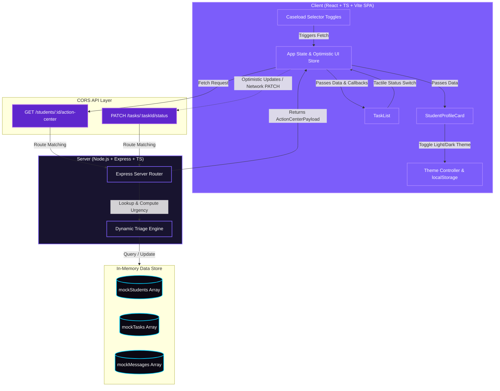

# Counselor Student Action Center

A lightweight, responsive, and visually stunning full-stack dashboard designed for academic counselors. The Counselor Student Action Center provides real-time triage summaries, enabling counselors to quickly evaluate a student's priorities, check upcoming or overdue tasks, monitor unread message counts, and dynamically update academic action plans.

---

## Project Architecture & Structure

The project is structured as a decoupled monorepo, cleanly dividing the backend API service and the frontend single-page application:

```
zyra/
├── server/                 # Node.js + Express + TypeScript Backend
│   ├── src/
│   │   ├── server.ts       # Express server, endpoints, & dynamic triage engine
│   │   ├── mockData.ts     # In-memory database populated with exact mock data
│   │   └── types.ts        # Common type interfaces (Student, Task, UrgencyLevel)
│   ├── tsconfig.json       # TypeScript configuration
│   └── package.json        # Unified scripts, dependencies, & inline nodemonConfig
│
└── client/                 # React + TypeScript + Vite + CSS Variables Frontend
    ├── src/
    │   ├── components/
    │   │   ├── StudentProfileCard.tsx # Displays GPA, enrollmentStatus risk, & unread counts
    │   │   └── TaskList.tsx           # Manages priority tasks and status buttons
    │   ├── App.tsx         # Caseload selectors, theme state, & optimistic updates
    │   ├── main.tsx        # React DOM mounting
    │   ├── index.css       # Design tokens (glassmorphism, dark/light themes overrides)
    │   └── types.ts        # Client-side type declarations
    ├── tsconfig.json       # TypeScript configuration
    └── package.json        # Client scripts and dependencies
```

### Architecture Diagram



### Architectural Design Highlights

1. **Dynamic Counselor Triage Engine**: Instead of storing static urgency labels, the backend dynamically calculates the student's triage badge (`Critical`, `Medium`, or `Low`) in real-time. A student is labeled **Critical** if their `enrollmentStatus === 'at_risk'`, they have any overdue `urgent` or `high` priority tasks, or they have 2 or more unread messages.
2. **Dual-Theme Design System**: Supports both a sleek glassmorphic night-purple **Dark Mode** (default) and an airy, modern lavender **Light Mode**. The UI theme can be toggled instantly from the header and is persisted across sessions using browser `localStorage`.
3. **Responsive Glassmorphism Styling**: Built strictly with vanilla CSS using HSL variables, container backdrop filters, transparent borders, Outfit headings, and responsive Grid layouts that adapt seamlessly from mobile viewports to desktop monitors.
4. **Optimistic Updates & Network Robustness**: When a counselor changes a task's status, the UI responds instantly and dynamically re-calculates the student's status badge. In the background, the client sends a `PATCH` request to the server. If a network interruption occurs, the frontend automatically rolls back to the original server state and alerts the user.

---

## Getting Started

### Prerequisites
- [Node.js](https://nodejs.org/) (v16.0.0 or higher recommended)
- `npm` (packaged with Node.js)

---

### Step 1: Run the Backend API Server
1. Open a terminal and navigate to the `server` directory:
   ```bash
   cd server
   ```
2. Install server dependencies:
   ```bash
   npm install
   ```
3. Start the hot-reloading development server:
   ```bash
   npm run dev
   ```
The backend server will launch and listen on **`http://localhost:5000`**.

---

### Step 2: Run the Frontend Application
1. Open a second terminal window and navigate to the `client` directory:
   ```bash
   cd client
   ```
2. Install client dependencies:
   ```bash
   npm install
   ```
3. Start the Vite development server:
   ```bash
   npm run dev
   ```
The frontend application will start up. Follow the terminal link to open it in your browser: **`http://localhost:5173/`**.

---

## API Contract

All endpoints support standard CORS and process standard JSON payloads.

### 1. Retrieve Action Center Data
- **Route**: `GET /students/:id/action-center` (supports `/api/students/:id/action-center` fallback)
- **Path Parameter**: `id` (e.g. `stu_001`, `stu_002`, `stu_003`)
- **Method**: `GET`
- **Response Code**: `200 OK` on success, `404 Not Found` if student ID doesn't exist.
- **Sample Response Payload**:
```json
{
  "student": {
    "id": "stu_001",
    "name": "Maya Patel",
    "email": "maya.patel@school.edu",
    "grade": 11,
    "gpa": 3.2,
    "counselorId": "csl_001",
    "enrollmentStatus": "at_risk",
    "unreadMessages": 2,
    "urgencyLevel": "Critical"
  },
  "tasks": [
    {
      "id": "tsk_001",
      "studentId": "stu_001",
      "title": "Submit FAFSA application",
      "description": "Deadline is approaching. Student has not started the form.",
      "status": "todo",
      "priority": "urgent",
      "dueDate": "2026-06-05",
      "createdAt": "2026-05-13T14:00:00Z",
      "updatedAt": "2026-05-13T14:00:00Z"
    },
    {
      "id": "tsk_002",
      "studentId": "stu_001",
      "title": "Meet with math tutor",
      "description": "Failing algebra — tutoring sessions must begin immediately.",
      "status": "in_progress",
      "priority": "high",
      "dueDate": "2026-06-01",
      "createdAt": "2026-05-21T09:00:00Z",
      "updatedAt": "2026-05-30T16:30:00Z"
    }
  ]
}
```

---

### 2. Update Task Status
- **Route**: `PATCH /tasks/:taskId/status` (supports `/api/tasks/:taskId/status` fallback)
- **Path Parameter**: `taskId` (e.g. `tsk_001`, `tsk_002`)
- **Method**: `PATCH`
- **Headers**: `Content-Type: application/json`
- **Request Body**:
```json
{
  "status": "completed" 
}
```
*Supported values: `"todo" | "in_progress" | "completed"`*

- **Response Code**: `200 OK` on success, `400 Bad Request` if status parameter is missing or invalid, `404 Not Found` if task ID doesn't exist.
- **Sample Response Payload**:
```json
{
  "id": "tsk_001",
  "studentId": "stu_001",
  "title": "Submit FAFSA application",
  "description": "Deadline is approaching. Student has not started the form.",
  "status": "completed",
  "priority": "urgent",
  "dueDate": "2026-06-05",
  "createdAt": "2026-05-13T14:00:00Z",
  "updatedAt": "2026-05-31T04:10:00Z"
}
```
