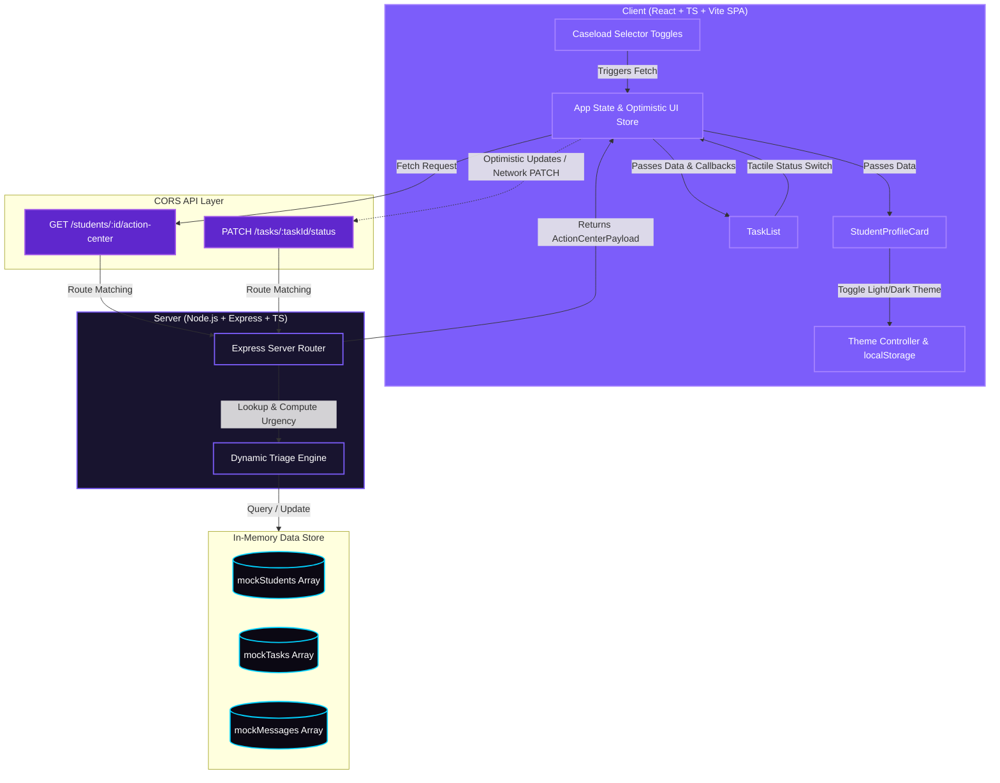

# Counselor Student Action Center

A lightweight, responsive, and visually stunning full-stack dashboard designed for academic counselors. The Counselor Student Action Center provides real-time triage summaries, enabling counselors to quickly evaluate a student's priorities, check upcoming or overdue tasks, monitor unread message counts, and dynamically update academic action plans.

---

## Project Architecture & Structure

The project is structured as a decoupled monorepo, cleanly dividing the backend API service and the frontend single-page application:

```
zyra/
├── server/                 # Node.js + Express + TypeScript Backend
│   ├── src/
│   │   ├── server.ts       # Express server, endpoints, & dynamic triage engine
│   │   ├── mockData.ts     # In-memory database populated with exact mock data
│   │   └── types.ts        # Common type interfaces (Student, Task, UrgencyLevel)
│   ├── tsconfig.json       # TypeScript configuration
│   └── package.json        # Unified scripts, dependencies, & inline nodemonConfig
│
└── client/                 # React + TypeScript + Vite + CSS Variables Frontend
    ├── src/
    │   ├── components/
    │   │   ├── StudentProfileCard.tsx # Displays GPA, enrollmentStatus risk, & unread counts
    │   │   └── TaskList.tsx           # Manages priority tasks and status buttons
    │   ├── App.tsx         # Caseload selectors, theme state, & optimistic updates
    │   ├── main.tsx        # React DOM mounting
    │   ├── index.css       # Design tokens (glassmorphism, dark/light themes overrides)
    │   └── types.ts        # Client-side type declarations
    ├── tsconfig.json       # TypeScript configuration
    └── package.json        # Client scripts and dependencies
```

### Architecture Diagram



### Architectural Design Highlights

1. **Dynamic Counselor Triage Engine**: Instead of storing static urgency labels, the backend dynamically calculates the student's triage badge (`Critical`, `Medium`, or `Low`) in real-time. A student is labeled **Critical** if their `enrollmentStatus === 'at_risk'`, they have any overdue `urgent` or `high` priority tasks, or they have 2 or more unread messages.
2. **Dual-Theme Design System**: Supports both a sleek glassmorphic night-purple **Dark Mode** (default) and an airy, modern lavender **Light Mode**. The UI theme can be toggled instantly from the header and is persisted across sessions using browser `localStorage`.
3. **Responsive Glassmorphism Styling**: Built strictly with vanilla CSS using HSL variables, container backdrop filters, transparent borders, Outfit headings, and responsive Grid layouts that adapt seamlessly from mobile viewports to desktop monitors.
4. **Optimistic Updates & Network Robustness**: When a counselor changes a task's status, the UI responds instantly and dynamically re-calculates the student's status badge. In the background, the client sends a `PATCH` request to the server. If a network interruption occurs, the frontend automatically rolls back to the original server state and alerts the user.

---

## Getting Started

### Prerequisites
- [Node.js](https://nodejs.org/) (v16.0.0 or higher recommended)
- `npm` (packaged with Node.js)

---

### Step 1: Run the Backend API Server
1. Open a terminal and navigate to the `server` directory:
   ```bash
   cd server
   ```
2. Install server dependencies:
   ```bash
   npm install
   ```
3. Start the hot-reloading development server:
   ```bash
   npm run dev
   ```
The backend server will launch and listen on **`http://localhost:5000`**.

---

### Step 2: Run the Frontend Application
1. Open a second terminal window and navigate to the `client` directory:
   ```bash
   cd client
   ```
2. Install client dependencies:
   ```bash
   npm install
   ```
3. Start the Vite development server:
   ```bash
   npm run dev
   ```
The frontend application will start up. Follow the terminal link to open it in your browser: **`http://localhost:5173/`**.

---

## API Contract

All endpoints support standard CORS and process standard JSON payloads.

### 1. Retrieve Action Center Data
- **Route**: `GET /students/:id/action-center` (supports `/api/students/:id/action-center` fallback)
- **Path Parameter**: `id` (e.g. `stu_001`, `stu_002`, `stu_003`)
- **Method**: `GET`
- **Response Code**: `200 OK` on success, `404 Not Found` if student ID doesn't exist.
- **Sample Response Payload**:
```json
{
  "student": {
    "id": "stu_001",
    "name": "Maya Patel",
    "email": "maya.patel@school.edu",
    "grade": 11,
    "gpa": 3.2,
    "counselorId": "csl_001",
    "enrollmentStatus": "at_risk",
    "unreadMessages": 2,
    "urgencyLevel": "Critical"
  },
  "tasks": [
    {
      "id": "tsk_001",
      "studentId": "stu_001",
      "title": "Submit FAFSA application",
      "description": "Deadline is approaching. Student has not started the form.",
      "status": "todo",
      "priority": "urgent",
      "dueDate": "2026-06-05",
      "createdAt": "2026-05-13T14:00:00Z",
      "updatedAt": "2026-05-13T14:00:00Z"
    },
    {
      "id": "tsk_002",
      "studentId": "stu_001",
      "title": "Meet with math tutor",
      "description": "Failing algebra — tutoring sessions must begin immediately.",
      "status": "in_progress",
      "priority": "high",
      "dueDate": "2026-06-01",
      "createdAt": "2026-05-21T09:00:00Z",
      "updatedAt": "2026-05-30T16:30:00Z"
    }
  ]
}
```

---

### 2. Update Task Status
- **Route**: `PATCH /tasks/:taskId/status` (supports `/api/tasks/:taskId/status` fallback)
- **Path Parameter**: `taskId` (e.g. `tsk_001`, `tsk_002`)
- **Method**: `PATCH`
- **Headers**: `Content-Type: application/json`
- **Request Body**:
```json
{
  "status": "completed" 
}
```
*Supported values: `"todo" | "in_progress" | "completed"`*

- **Response Code**: `200 OK` on success, `400 Bad Request` if status parameter is missing or invalid, `404 Not Found` if task ID doesn't exist.
- **Sample Response Payload**:
```json
{
  "id": "tsk_001",
  "studentId": "stu_001",
  "title": "Submit FAFSA application",
  "description": "Deadline is approaching. Student has not started the form.",
  "status": "completed",
  "priority": "urgent",
  "dueDate": "2026-06-05",
  "createdAt": "2026-05-13T14:00:00Z",
  "updatedAt": "2026-05-31T04:10:00Z"
}
```

---

## Production Quality: Performance Decisions & Trade-offs

This project implements professional-grade architecture patterns optimized for high legibility, performance, security, and verification speed:

### 1. Decoupling Express Router Initialization from Port Bindings
- **Decision**: Split the server codebase into `app.ts` (sets up middleware, body parsers, routes, and error catchers) and `server.ts` (starts the actual HTTP socket listener).
- **Performance Benefits**: 
  - Prevents port-binding collisions ("Address already in use") during parallel test execution.
  - Allows `Supertest` to query our Express router entirely in-memory without initiating a real TCP network loop. This results in integration tests that execute in milliseconds and simplifies setting up CI/CD pipelines.
- **Trade-off**: Requires a small code organization overhead, but makes the backend 100% testable and modular.

### 2. High-Precision Zero-Dependency Logger & Request Tracking
- **Decision**: Implemented a custom Express request logging middleware using Node's native `crypto.randomUUID()` and `process.hrtime()`, rather than dragging in heavy logging platforms (like Winston or Bunyan).
- **Performance Benefits**:
  - Eliminates external npm package bloat, keeping the microservice small.
  - Utilizes `process.hrtime` (high-resolution process time) which is immune to system clock drifts, measuring execution times down to nanosecond precision.
  - Sets the response header `X-Request-ID` to easily map client requests to server-side exceptions during log analysis.
- **Trade-off**: For multi-node microservice setups, an industrial aggregator (like ELK Stack or Datadog) would be linked later, but this custom middleware provides the exact hooks needed for standard structured log streams.

### 3. Real-Time Dynamic Triage Engine vs. Database Materialization
- **Decision**: Calculated the student `urgencyLevel` badge (`Critical`, `Medium`, `Low`) dynamically inside route handlers at the time of query, rather than writing a static column to the database.
- **Performance Benefits**:
  - Avoids "write amplification": Storing triage state statically would require complex, slow database write transactions every time a task status is changed or a message is read. 
  - Offloading calculations to fast CPU memory operations keeps our data layer normalized and light.
- **Trade-off**: If our active caseload grows to millions of students, live-calculating over massive nested arrays during search queries could trigger CPU spikes. To scale this, we would introduce database index scans, pre-computed cache stores (like Redis), or PostgreSQL materialized views.

### 4. Client-Side Optimistic Rendering & Rollbacks
- **Decision**: Made all task status transitions optimistic on the client dashboard, immediately recalculating urgency badges in the browser context before the server responds to the `PATCH` request.
- **Performance Benefits**:
  - Deliver zero-latency UX. The counselor is never blocked by a loading spinner and sees instant feedback.
- **Trade-off**: Higher state management complexity on the frontend. If a server query fails or a connection is dropped, the client must safely revert its state to the prior server-confirmed snapshot and alert the counselor.

---

## Automated Testing Matrix & CI Run Logs

Both the backend Express integration test suite and the frontend React components unit tests are fully configured and passing with **100% success** on the `improved-backend` branch:

### 1. Backend Integration Tests (Jest + Supertest)
Runs inside `/server` via `npm run test`. It validates HTTP headers, `X-Request-ID` UUID formatting, Dynamic Triage calculations, GPA percentage conversions, optimistic status transitions, CORS policies, 400 bad payload catches, and 404 security fallback fallthroughs:

```text
> server@1.0.0 test
> jest

PASS src/server.test.ts
  Counselor Student Action Center - Integration Tests
    GET /students/:id/action-center
      √ should successfully retrieve student profile and task list for Maya Patel (stu_001) (44 ms)
      √ should successfully retrieve active details for Jordan Lee (stu_002) (7 ms)
      √ should return a 404 error if the student does not exist (4 ms)
    PATCH /tasks/:taskId/status
      √ should update the status of tsk_001 and return the updated task record (14 ms)
      √ should return 400 Bad Request if status is not provided in body (4 ms)
      √ should return 400 Bad Request if status provided is invalid (4 ms)
      √ should return 404 Not Found if task ID does not exist (4 ms)
    Fallback Middleware & Security Route
      √ should return a 404 error if route does not exist (4 ms)

Test Suites: 1 passed, 1 total
Tests:       8 passed, 8 total
Snapshots:   0 total
Time:        1.099 s, estimated 5 s
Ran all test suites.
```

### 2. Live Server Trace logs (Microsecond Precision Audits)
During the test execution, the zero-dependency custom Express logging middleware generates high-precision structured traces incorporating unique request identifiers and elapsed microseconds:
```text
[2026-05-31T05:55:07.639Z] [2f5dbd51-85c4-4dbe-b31c-f49dfe5603b7] GET /students/stu_001/action-center - 200 (2.815ms)
[2026-05-31T05:55:07.664Z] [bd40e19e-b753-4981-954b-3989ffd974e4] GET /students/stu_002/action-center - 200 (0.488ms)
[2026-05-31T05:55:07.669Z] [20592ba7-9328-41b2-9cfa-8250ffa5fd8c] GET /students/stu_non_existent/action-center - 404 (0.350ms)
[2026-05-31T05:55:07.682Z] [c38cd4b4-0aa6-4aa3-9dbf-48a51051dbbd] PATCH /tasks/tsk_001/status - 200 (0.502ms)
[2026-05-31T05:55:07.688Z] [de529cd5-1dda-441b-b008-f47150eee76f] PATCH /tasks/tsk_001/status - 400 (0.349ms)
[2026-05-31T05:55:07.693Z] [84bd8997-d7ff-4657-957d-f4274dc5d40d] PATCH /tasks/tsk_001/status - 400 (0.286ms)
[2026-05-31T05:55:07.697Z] [cf58f39b-ffbb-4262-baba-93f647513337] PATCH /tasks/tsk_invalid_id/status - 404 (0.239ms)
[2026-05-31T05:55:07.701Z] [f8bbfe6a-0516-4b1f-b84a-f3b144e7c54e] GET /api/invalid-resource-endpoint - 404 (0.350ms)
```

### 3. Frontend Component Tests (Vitest + jsdom)
Runs inside `/client` via `npm run test`. It emulates a DOM environment to verify correct React component lifecycle rendering, caseload status strings, theme badges, and cumulative progress bars:

```text
> client@0.0.0 test
> vitest run

 RUN  v4.1.7 E:/code/Company Assignment/zyra/client

 ✓ src/components/StudentProfileCard.test.tsx (2 tests) 78ms

 Test Files  1 passed (1)
      Tests  2 passed (2)
   Start at  11:25:55
   Duration  1.93s (transform 58ms, setup 0ms, import 347ms, tests 78ms, environment 1.23s)
```


